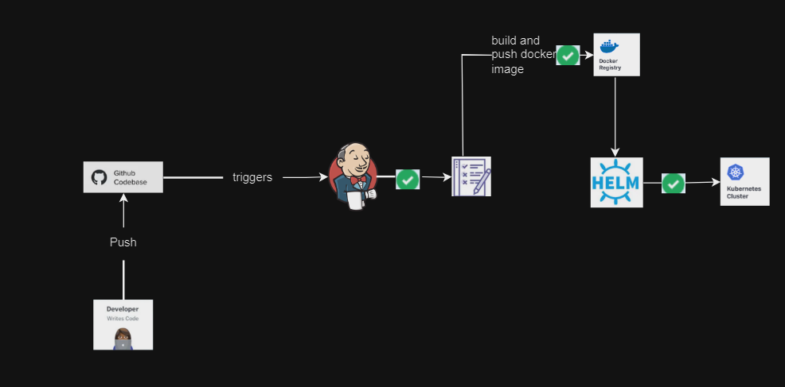

<h3> Step by Step Guid For Setting up A CI/CD Pipeline That Deploys <br /> 
This Application To A Kubernetes Cluster <br /> 
With Helm</h3>

http-echo
=========


HTTP Echo is a small go web server that serves the contents it was started with
as an HTML page.

The default port is 5678, but this is configurable via the `-listen` flag:

```
http-echo -listen=:8080 -text="hello world"
```

Then visit http://localhost:8080/ in your browser.

## Synopsis
This documentation covers the steps for deploying this application to a kubernetes cluster using helm chart, before walking down the steps I will go over listing out the DevOps tools used in carrying out this project.


Prequesite
==========


- Linux
- Git
- Linux
- Docker Desktop
- Docker Hub Account
- Helm
- Go
- Jenkins

Lets devlve straight into the steps took to accomplishing this project. note that we're going to run alot of command to accomplish this task as such I am strickly just going to be walking us through those steps of deploying our application to a kubernetes cluster using helm chart, additionally I would be using Jenkins in creating our pipeline.

## 1. Step 

Clone the project repository to your pc using the command & cd into it and open it with your fovorite code editor, I used vscode in my case.

```
git clone https://github.com/Awodi-Emmanuel/http-echo.git
cd http-echo
```

## 2. Step 

This step now is to test our Go application locally to see if it's working before we can go ahead and dockerise it, make sure that you have your Go setup in place and run the command provided with documentation to test the application.

[follow link to see how to installl Go on your OSes](https://go.dev/doc/tutorial/getting-started#install)

The default port is 5678, but this is configurable via the `-listen` flag:

```
http-echo -listen=:8080 -text="hello world"
```

Then visit http://localhost:8080/ in your browser.

## 3. Step
Time to dockerise our Go application, I like to write my docker file, create a file named `Dockerfile` in your http-echo app root directory. Make sure you have your Docker Destop up and running in my case I have wsl enabled from my docker destop to enable me use my wsl terminal. 

[Follow link to install Docker Destop on you PC](https://docs.docker.com/desktop/install/windows-install/)

Then build docker image by running

```
docker build -t img-http-echo .
```
I am not going to delve into explaining much on building go dockers image [follow link for context](https://docs.docker.com/language/golang/build-images/)

## 4. Step

Lets run our docker container from our project root directory like as we did for our image map localhost port to the container entry port like this:

```
docker run -d -p 8080:5678 --name img-http-echo htttp-echo-container
```
Then visit http://localhost:8080/ in your browser.

## 5. Step

Now it is time to automate our CI/CD Pipeline with Jenkins, few plugins are required to build our jenkins job just to name a few. 

- Docker Pipeline
- Docker plugin
- Pipeline Utility Step
- Go Plugin
- Kubernetes

## 6. Step 

Configured jenkins controller with Github, Docker hub and Kubeconfig credentials and the neccssary global configuration environment and webhooks to trigger a build once a push is made to the repository branch ```release/dev``` [Learn more on jenkins pipeline](https://www.jenkins.io/doc/book/pipeline/)


## 7. Step
Configure your kubernetes cluster [roles and role binding RBAC](https://kubernetes.io/docs/reference/access-authn-authz/rbac/) on your server with the following setup:

- [Setup Helm](https://helm.sh/docs/intro/install/) 
- [Create K8S namespace && Service account](https://kubernetes.io/docs/reference/access-authn-authz/service-accounts-admin/#:~:text=In%20Kubernetes%2C%20service%20accounts%20are,tied%20to%20complex%20business%20processes).

## 8. Step
Created a helm chart and modified the deployment and service manifest as suit the project and make a push to the ```release/dev``` branch then jenkins job got triggered and build CI/CD stages and rollout the helm chart configuration and deployed to my k8s cluster. 


## Summary
This project dockerised this Go web server and built a CI/CD pipeline with the flow of the pipeline having five stages. 
1. First stage checks for the Go version after passed then stage 
2. Build application Image and stage 
3. Stage pushed the docker image to docker hub, 
4. Stage remove unused docker image  
5. This stage deploys our application to a kubernets cluster using a kubernetes package manager(Helm) if deployment is successful an IP alongside a port would be generated in my case  http://127.0.0.1:8080

We can rollback our deployment for more of helm and kubernetes command visit [here](https://helm.sh/docs/helm/) .
This docs can be better your contributions are welcome.